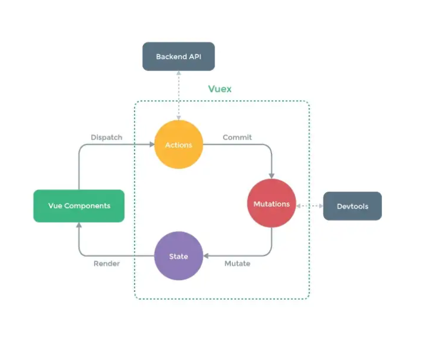
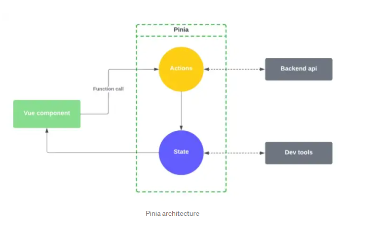

# Migrate from Vuex to Pinia 🍍

##  What is Pinia?

For state management purpose (just like Vuex) with more features (for replacing Vuex)

## Why should we use Vuex?

- Pinia is simpler and intuitive than Vuex.
- Pinia brings the benefirs of Composition API (I have written an [article](https://github.com/vuquangpham/compositions-api-vuejs) about why should we use Compositions API and migrate from Options API to Compositions API)
- Pinia supports `Typescript` (I haven't used `Typescript ` before, so I don't have any ideas about `Typescript` in Vuex and `Typescript` in Pinia)

## Comparing Pinia vs Vuex

### Syntax

I have to describe the difference of `syntax` first, because others different has relied on it.

#### Vuex

In Vuex, behind the scene, we have to merge all `modules` into one big store (you have to know about `module` and `namespaced` in Vuex to exactly know this).

So, If I only want to use `store` of `moduleA`, I have to import `store` (the biggest store) and just use 1 module inside 🙄🙄

```javascript
// Vuex Store
export default createStore({
    modules: {
        coaches: coachesModule,
        requests: requestsModule,
        auth: authModule
    },
});
```

### Pinia

Pinia doesn't use `Vuex module pattern`. In Pinia, we can create multiples stores separately and that can be imported into components directly when we're needed.

```javascript
// Pinia Store
export const useCounterStore = defineStore('counter', {
  state: () => ({
    count: 0,
  }),
})

// in component
const store = useCounterStore()
```

### Diagram ([Source](https://betterprogramming.pub/testing-pinia-is-vuex-out-43e0531824f5))

#### Vuex



#### Pinia



### Getters

Getters in `Vuex Store` get a lots parameters 😑

````javascript
// Vuex Store
export default createStore({
    state: {
        data: [],
    },
    getters: {
        getData(state, getters, rootState, rootGetters) {}
    }
})

// in component
export default {
    computed: {
        getData() {
            return this.$store.getters['moduleA/getData']; // "nice" syntax
        }
    }
}
````

Getters in `Pinia` are very nice

```javascript
// in component
const store = useCounterStore()

// access
store.count; // just like that

```

### Mutations

We can see that in `Pinia`, we don't need `mutations` (exist in `Vuex`).

```
In Vuex, we have a convention that: 
- Mutations: just do sync action
- Actions: do async action (then call Mutations to save if we're needed) 
```

Example:

```javascript
// in Vuex
const store = createStore({
    state: {
        data: [],
    },
    getters: {},
    mutations: {
        saveData(state, payload) {
            state.data = payload;
        }
    },
    actions: {
        getDataFromServer(context, payload) {
            // do some ASYNC function
            // then call mutations to save the data to Vuex
            fetch('https://something.demo', {
                method: 'POST',
                body: JSON.stringify(payload)
            })
                .then((data) => {
                    // save data to Vuex Store
                    context.commit('saveData', data);
                })
        }
    }
})

// in Pinia
const store = defineStore('data', {
    state: () => ({
        data: []
    }),
    actions: {
        saveData(payload) {
            // do some ASYNC function
            fetch('https://something.demo', {
                method: 'POST',
                body: JSON.stringify(payload)
            })
                .then(() => {
                    // save data to Pinia directly, no need mutations
                    this.data = data;
                })
        }
    }
})
```

### More features in Pinia

- Auto completion
- We can setup stores by using `Composition API` ([see it](https://pinia.vuejs.org/core-concepts/#setup-stores))
- We can use `map` as the same as Vuex (mapState, mapActions, ...) ([more details](https://pinia.vuejs.org/core-concepts/))
- [Plugins](https://pinia.vuejs.org/core-concepts/plugins.html) 
- Subscribing to [state](https://pinia.vuejs.org/core-concepts/state.html#subscribing-to-the-state), [actions](https://pinia.vuejs.org/core-concepts/actions.html#subscribing-to-actions)

And that's it!!! We can get more details on Pinia [documentation](https://pinia.vuejs.org/)

